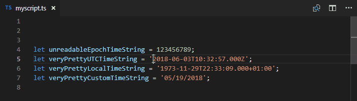

# VS Code Time Converter &#8212; timing

[](https://marketplace.visualstudio.com/items?itemName=HaaLeo.timing) [](https://marketplace.visualstudio.com/items?itemName=HaaLeo.timing) [](https://marketplace.visualstudio.com/items?itemName=HaaLeo.timing#review-details) [](https://github.com/HaaLeo/vscode-timing/stargazers)  
[](https://raw.githubusercontent.com/HaaLeo/vscode-timing/master/LICENSE.txt) [](https://travis-ci.org/HaaLeo/vscode-timing) [](https://codecov.io/gh/HaaLeo/vscode-timing)  
[](https://david-dm.org/HaaLeo/vscode-timing) [](https://david-dm.org/HaaLeo/vscode-timing?type=dev) [](http://makeapullrequest.com)  
[](https://www.paypal.me/LeoHanisch)

## Description

The *timing* extension converts and visualizes a given time to various formats.  
This extension was inspired by [zodiac403's epoch-time-converter](https://github.com/zodiac403/epoch-time-converter).

> All breaking changes of **v1.0.0** are listed in the [changelog](CHANGELOG.md)

## Installation

### Via Visual Studio Code

1. Press <kbd>Ctrl</kbd> + <kbd>P</kbd> to open the _Go to File..._ view
2. Type `ext install HaaLeo.timing` and press <kbd>Enter</kbd>

### From VSIX

1. Download the `.vsix` file of the latest [release from GitHub](https://github.com/HaaLeo/vscode-timing/releases)
2. Run `code --install-extension timing-*.*.*.vsix` in the command line ([reference](https://code.visualstudio.com/docs/editor/extension-gallery#_install-from-a-vsix))

## Features

Currently this extension is capable to do the following conversions, where the _epoch_ time can be formated in **seconds**, **milliseconds** or **nanoseconds**, and _custom_ is a [momentjs format](https://momentjs.com/docs/#/displaying/format/), that you can specify in the settings or insert during the conversion:  

| Source Format| ⟶ | Target Format|
|:--|:--:|:-- |
| Epoch (s, ms, ns) | ⟶ | ISO 8601 Local|
| Epoch (s, ms, ns) | ⟶ | ISO 8601 UTC|
| Epoch (s, ms, ns) | ⟶ | Custom|
| ISO 8601 / RFC 2282 | ⟶ | Epoch (s, ms, ns)|
| ISO 8601 / RFC 2282 | ⟶ | Custom|
| - | ⟶ | Now as Epoch (s, ms, ns)|
| - | ⟶ | Now as ISO 8601 Local|
| - | ⟶ | Now as ISO 8601 UTC|
| - | ⟶ | Now as Custom|
| Custom | ⟶ | Epoch (s, ms, ns)|
| Custom | ⟶ | ISO 8601 Local|
| Custom | ⟶ | ISO 8601 Utc|

Whether the current selection is replaced with the converted time, is indicated by the `timing.insertConvertedTime` setting.  

When the _epoch time is the **source**_ format of the conversion its unit is determined by its **digit count**:

| Minimum Length| Maximum Length| Used Unit |
|:--:|:--:|:--:|
| 1 | 11| **s**
|12 | 14| **ms**
|15 | 21| **ns**

>**Note**: Currently those boundaries are fixed and cannot be changed.

When the _epoch time is the **target**_ format of the conversion you can select its unit during the conversion process.  

### Conversion via Command Palette

#### Simple Conversion

In order to convert a time via the command palette there exist several commands. Each command will show up an input box where you can enter the time. After pressing <kbd>Enter</kbd> it will display the converted time in the input box again, ready to be copied.


#### Pre-selection

If a valid time string is pre-selected, the command will directly convert the selection and show the corresponding result.


#### Options

If required, the command will ask you to select the **target format** of the time.


### Current Time

In addition, you can also get the current time as **epoch**, **ISO 8601**, or **custom** format.


### Custom Formats

To convert different times from/to custom formats you need to insert a **valid [momentjs format](https://momentjs.com/docs/#/displaying/format/)** after you invoke a corresponding command.  


Optionally you can specify **custom formats** of the following shape in the user settings. Those will be shown as possible options.  
Example:

```JSON
{
    "timing.customFormats": [
        {
            "format": "LLLL",
            "description": "US",
            "detail": "Often used in the US"
        },
        {
            "format": "DD.MM.YYYY HH:mm:ss",
            "description": "GER",
            "detail": "Often used in Germany"
        }
    ]
}
```

### Hover Preview

When you hover over a number the extension shows you the converted **UTC**, **Local**, or **Custom** time and which **unit** was used for the conversion. The target time is indicated by the `timing.hoverTargetFormat` setting. Its default value is `utc`.


### Insert Converted Time

You can add the setting `"timing.insertConvertedTime": true` in order to automatically replace the cursor's selection with the converted time. To enable that behavior there exists the command `timing.toggleInsertConvertedTimeUserLevel` to toggle this setting (on User Level).  
Alternatively, you can press the pencil button in the top right corner.



## Settings Overview

* `timing.customFormats`: An array of custom source/target formats used to convert from/to
* `timing.insertConvertedTime`: Indicates whether a converted time is inserted at the cursor's current position after conversion
* `timing.ignoreFocusOut`: Indicates whether the input boxes remain visible when the focus is lost
* `timing.hideResultViewOnEnter`: Indicates whether the result view is hidden when enter is pressed. When set to `false` the command will restart
* `timing.hoverTargetFormat`: indicates the target format of the hover preview. Possible values are:
  * `utc`: Show the hover preview in ISO 8601 UTC time. This is the default value.
  * `local`: Show the hover preview in ISO 8601 Local time.
  * `disable`: No hover preview is shown.
  * A custom [momentjs format](https://momentjs.com/docs/#/displaying/format/): For instance `LLLL`.

## Command Overview

* `timing.customToEpoch`: Custom ⟶ Epoch
* `timing.customToIsoUtc`: Custom ⟶ ISO 8601 UTC
* `timing.customToIsoLocal`: Custom ⟶ ISO 8601 Local
* `timing.epochToIsoUtc`: Epoch ⟶ ISO 8601 UTC
* `timing.epochToIsoLocal`: Epoch ⟶ ISO 8601 Local
* `timing.epochToCustom`: Epoch ⟶ Custom
* `timing.isoRfcToEpoch`: ISO 8601 / RFC 2822 ⟶ Epoch
* `timing.isoRfcToCustom`: ISO 8601 / RFC 2822 ⟶ Custom
* `timing.nowAsCustom`: Now ⟶ Custom
* `timing.nowAsEpoch`: Now ⟶ Epoch
* `timing.nowAsIsoLocal`: Now ⟶ Epoch
* `timing.nowAsIsoUtc`: Now ⟶ Epoch
* `timing.toggleInsertConvertedTimeUserLevel`: toggle the `timing.insertConvertedTime` user setting

## Keyboard Shortcuts

Any of the above commands can be bound to its own keyboard shortcut. For that just open the _Keyboard Shortcuts_ view by pressing <kbd>Ctrl</kbd>+<kbd>K</kbd> <kbd>Ctrl</kbd>+<kbd>S</kbd>. Now search for the corresponding command and assign it to a shortcut.  
Alternatively, you can edit the `keybindings.json` directly. For example you can add the following entry to the `keybindings.json` to bind the `timing.epochToIsoUtc` to the keyboard shortcut <kbd>Ctrl</kbd>+<kbd>K</kbd> <kbd>Ctrl</kbd>+<kbd>Z</kbd>.  
For further information check out the [docs](https://code.visualstudio.com/docs/getstarted/keybindings).

```JSON
{
    "key": "ctrl+k ctrl+z",
    "command": "timing.epochToIsoUtc"
}
```

## Contribution

If you found a bug or are missing a feature do not hesitate to [file an issue](https://github.com/HaaLeo/vscode-timing/issues/new).  
Pull Requests are welcome!

## Support
When you like this extension make sure to [star the repo](https://github.com/HaaLeo/vscode-timing/stargazers) and [write a review](https://marketplace.visualstudio.com/items?itemName=HaaLeo.timing#review-details). I am always looking for new ideas and feedback.  
In addition, it is possible to [donate via paypal](https://www.paypal.me/LeoHanisch).
