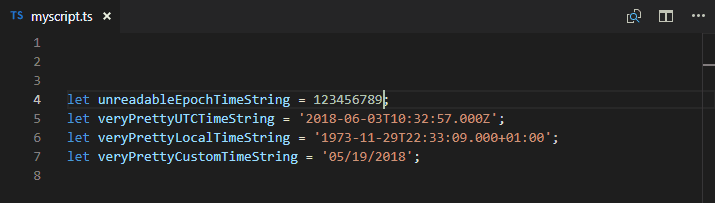

# VS Code Time Converter &#8212; timing

[](https://marketplace.visualstudio.com/items?itemName=HaaLeo.timing) [](https://marketplace.visualstudio.com/items?itemName=HaaLeo.timing) [](https://marketplace.visualstudio.com/items?itemName=HaaLeo.timing#review-details) [](https://github.com/HaaLeo/vscode-timing/stargazers)  
[](https://raw.githubusercontent.com/HaaLeo/vscode-timing/master/LICENSE.txt) [](https://dev.azure.com/HaaLeo/vscode-timing/_build/latest?definitionId=2&branchName=master) [](https://codecov.io/gh/HaaLeo/vscode-timing)  
[](https://david-dm.org/HaaLeo/vscode-timing) [](https://david-dm.org/HaaLeo/vscode-timing?type=dev) [](http://makeapullrequest.com)  
[](https://www.paypal.me/LeoHanisch/3eur)

## Description

The *timing* extension converts and visualizes a given time to various formats.  
This extension was inspired by [zodiac403's epoch-time-converter](https://github.com/zodiac403/epoch-time-converter).

> All breaking changes of **v2.0.0** are listed in the [changelog](CHANGELOG.md#changelog)

## Installation

### Via Visual Studio Code

1. Press <kbd>Ctrl</kbd> + <kbd>P</kbd> to open the _Go to File..._ view
2. Type `ext install HaaLeo.timing` and press <kbd>Enter</kbd>

### From VSIX

1. Download the `.vsix` file of the latest [release from GitHub](https://github.com/HaaLeo/vscode-timing/releases)
2. Run `code --install-extension timing-*.*.*.vsix` in the command line ([reference](https://code.visualstudio.com/docs/editor/extension-gallery#_install-from-a-vsix))

## Features

Currently this extension is capable to do the following conversions, where the _epoch_ time can be formated in **seconds**, **milliseconds** or **nanoseconds**, and _custom_ is a localized [momentjs format](https://momentjs.com/docs/#/displaying/format/), that you can specify in the settings or insert during the conversion. Epoch times can be converted to a human readable _timestamp_ or _duration_.  

 Source Format| ⟶ | Target Format| Example
:--|:--:|:-- |:--
Epoch (s, ms, ns) | ⟶ | ISO 8601 UTC| [Link](#simple-conversion)
Epoch (s, ms, ns) | ⟶ | ISO 8601 Local
Epoch (s, ms, ns) | ⟶ | Custom
Epoch (s, ms, ns) | ⟶ | ISO 8601 Duration
Epoch (s, ms, ns) | ⟶ | Human Readable Duration
ISO 8601 Duration | ⟶ | Epoch (s, ms, ns)
ISO 8601 / RFC 2282 | ⟶ | Epoch (s, ms, ns)
ISO 8601 / RFC 2282 | ⟶ | Custom| [Link](#custom-formats)
\- | ⟶ | Now as Epoch (s, ms, ns)
\- | ⟶ | Now as ISO 8601 UTC
\- | ⟶ | Now as ISO 8601 Local| [Link](#current-time)
\- | ⟶ | Now as Custom
Custom | ⟶ | Custom
Custom | ⟶ | Epoch (s, ms, ns)
Custom | ⟶ | ISO 8601 Utc
Custom | ⟶ | ISO 8601 Local

Whether the current selection is [replaced](#insert-converted-time) with the converted time, is indicated by the `timing.insertConvertedTime` setting. When you already [pre-selected](#pre-selection) a valid epoch time, the extension will directly convert this selection instead of asking for your input.

When the _epoch time is the **source**_ format of the _timestamp_ conversion its unit is determined by its **digit count**:

Minimum Length| Maximum Length| Used Unit
:--:|:--:|:--:
1 | 11| **s**
12 | 14| **ms**
15 | 21| **ns**

>**Note**: Currently those boundaries are fixed and cannot be changed.

When the _epoch time is the **target**_ format of the timestamp conversion you can select its unit during the conversion process.  

When the _epoch time is the **source**_ format of the duration conversion you can select its unit during the conversion process.  

Further the extension shows a [hover preview](#hover-preview) of the converted _timestamp_ and _duration_ when the mouse is moved over a valid epoch time.

## Settings Overview

* `timing.clipboard.readingEnabled`: Indicates whether the extension should try to get the input time from the clipboard instead of asking the user for input.
* `timing.clipboard.writingEnabled`: Indicates whether the result of the conversion is written to the clipboard. When enabled, no result view will be shown.
* `timing.customFormats`: An array of custom source/target formats used to convert from/to.
* `timing.hideResultViewOnEnter`: Indicates whether the result view is hidden when enter is pressed. When set to `false` the command will restart.
* `timing.hiddenCommands`: List of commands that shall be hidden from the command palette.
* `timing.hoverDuration.enabled`: Controls whether the duration hover is enabled or disabled.
* `timing.hoverDuration.sourceUnit`: Indicates the source epoch unit for the duration hover preview. It can be either "s", "ms" or "ns".
* `timing.hoverDuration.useISOTargetFormat`: Indicates whether the ISO 8601 duration definition is used as target format for the hover.
* `timing.hoverTimestamp.enabled`: Controls whether the timestamp hover is enabled or disabled.
* `timing.hoverTimestamp.targetFormat`: Indicates the target format of the hover preview. Possible values:
  * `utc`: Show the hover preview in ISO 8601 UTC time. This is the default value.
  * `local`: Show the hover preview in ISO 8601 Local time.
  * A custom [momentjs format](https://momentjs.com/docs/#/displaying/format/): For instance `LLLL`.  

  In addition, you can specify multiple formats via an array. When doing so, you can add further options for custom formats. E.g.:
  ```json
  {
      "timing.hoverTimestamp.targetFormat": [
          "local",
          "utc",
          "DD.MM.YYYY HH:mm:ss",
          {
              "customFormat": "DD.MM.YYYY HH:mm:ss",
              "localize": false,
              "name": "My Format"
          }
      ]
  }
  ```

* `timing.ignoreFocusOut`: Indicates whether the input boxes remain visible when the focus is lost.
* `timing.insertConvertedTime`: Indicates whether a converted time is [inserted](#insert-converted-time) at the cursor's current position after conversion. When enabled, no result view is shown.

## Command Overview

To view all commands, open the _command palette_ and type _Timing_.  
Optional arguments can be used to reduce the amount of required user inputs during a conversion. They can only be used when the command is invoked via a [hotkey](#keyboard-shortcuts).  

Command Id | Description | Optional Arguments (`string`)
:--|:-- |:--
`timing.customToCustom`| Custom ⟶ Custom | `sourceFormat`, `targetFormat`
`timing.customToEpoch`| Custom ⟶ Epoch | `sourceFormat`, `targetUnit`
`timing.customToIsoLocal`| Custom ⟶ ISO 8601 Local | `sourceFormat`
`timing.customToIsoUtc`| Custom ⟶ ISO 8601 UTC | `sourceFormat`
`timing.epochToCustom`| Epoch ⟶ Custom | `targetFormat`
`timing.epochToIsoDuration`| Epoch ⟶ ISO 8601 Duration | `sourceUnit`
`timing.epochToIsoLocal`| Epoch ⟶ ISO 8601 Local
`timing.epochToIsoUtc`| Epoch ⟶ ISO 8601 UTC
`timing.epochToReadableDuration`| Epoch ⟶ Readable Duration | `sourceUnit`
`timing.isoDurationToEpoch`| ISO 8601 Duration ⟶ Epoch | `targetUnit`
`timing.isoRfcToCustom`| ISO 8601 / RFC 2822 ⟶ Custom | `targetFormat`
`timing.isoRfcToEpoch`| ISO 8601 / RFC 2822 ⟶ Epoch | `targetUnit`
`timing.nowAsCustom`| Now ⟶ Custom | `targetFormat`
`timing.nowAsEpoch`| Now ⟶ Epoch | `targetUnit`
`timing.nowAsIsoLocal`| Now ⟶ Epoch
`timing.nowAsIsoUtc`| Now ⟶ Epoch
`timing.toggleInsertConvertedTimeUserLevel`| toggle the `timing.insertConvertedTime` user setting

## Keyboard Shortcuts

Any of the above commands can be bound to its own keyboard shortcut. For that just open the _Keyboard Shortcuts_ view by pressing <kbd>Ctrl</kbd>+<kbd>K</kbd> <kbd>Ctrl</kbd>+<kbd>S</kbd>. Now search for the corresponding command and assign it to a shortcut.  
Alternatively, you can edit the `keybindings.json` directly. For example you can add the following entry to the `keybindings.json` to bind the `timing.customToEpoch` to the keyboard shortcut <kbd>Ctrl</kbd>+<kbd>K</kbd> <kbd>Ctrl</kbd>+<kbd>Z</kbd>.  

```JSON
{
    "key": "ctrl+k ctrl+z",
    "command": "timing.customToEpoch"
}
```

Further if you know that you will always use the same parameter for the command you can add _optional arguments_.  
Example:

```JSON
{
    "key": "ctrl+k ctrl+z",
    "command": "timing.customToEpoch",
    "args": {
        "sourceFormat": "DD/MM/YYYY",
        "targetUnit": "ms"
    }
}
```

For further information check out the [docs](https://code.visualstudio.com/docs/getstarted/keybindings).

## Contribution

If you found a bug or are missing a feature do not hesitate to [file an issue](https://github.com/HaaLeo/vscode-timing/issues/new/choose).  
Pull Requests are welcome!

## Support
When you like this extension make sure to [star the repo](https://github.com/HaaLeo/vscode-timing/stargazers) and [write a review](https://marketplace.visualstudio.com/items?itemName=HaaLeo.timing#review-details). I am always looking for new ideas and feedback.  
In addition, it is possible to [donate via paypal](https://www.paypal.me/LeoHanisch/3eur).

## Examples

### Conversion via Command Palette

#### Simple Conversion

In order to convert a time via the command palette there exist several commands. Each command will show up an input box where you can enter the time. After pressing <kbd>Enter</kbd> it will display the converted time in the input box again, ready to be copied.


#### Pre-selection

If a valid time string is pre-selected, the command will directly convert the selection and show the corresponding result.



#### Options

If required, the command will ask you to select the **target format** of the time.


### Current Time

In addition, you can also get the current time as **epoch**, **ISO 8601**, or **custom** format.


### Custom Formats

To convert different times from/to custom formats you need to insert a **valid [momentjs format](https://momentjs.com/docs/#/displaying/format/)** after you invoke a corresponding command.  


Optionally you can specify **custom formats** of the following shape in the user settings. Those will be shown as possible options.  
Example:

```JSON
{
    "timing.customFormats": [
        {
            "format": "LLLL",
            "description": "US",
            "detail": "Often used in the US"
        },
        {
            "format": "DD.MM.YYYY HH:mm:ss",
            "description": "GER",
            "detail": "Often used in Germany"
        }
    ]
}
```

### Hover Preview

When you hover over a number the extension shows you the converted **UTC**, **Local**, or **Custom** timestamp and which **unit** was used for the conversion. The target time is indicated by the `timing.hoverTimestamp.targetFormat` setting. Its default value is `utc`.  Further it also shows the converted duration.  

Both hover provider can be configured via several [settings](#settings-overview)


### Insert Converted Time

You can add the setting `"timing.insertConvertedTime": true` in order to automatically replace the cursor's selection with the converted time. When `timing.insertConvertedTime` is set to `true`, no result view will be shown. To enable that behavior there exists the command `timing.toggleInsertConvertedTimeUserLevel` to toggle this setting (on User Level).  
Alternatively, you can press the pencil button in the top right corner of the result view.

* `"timing.insertConvertedTime": true`  
  
* `"timing.insertConvertedTime": false`  
  
