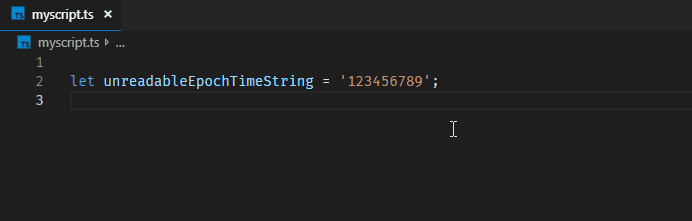

# Timing

    

## Description
The *Timing* extension converts and visualizes a given epoch time into a human readable time string.
This extension was inspired by  
[zodiac403's  epoch-time-converter](https://github.com/zodiac403/epoch-time-converter).

## Features

Currently this extension is capable to convert a given epoch time string into an ISO 8601 string.
The epoch time string can be in **seconds**, **milliseconds** or **nanoseconds**. Which unit is assumed for a given epoch time is determined by its digit count:

| Minimum Length| Maximum Length| Used Unit |
|:--:|:--:|:--:|
| 1 |11| **s**
|12 | 14| **ms**
|15 | 21| **ns**

>**Note**: Currently those boundaries are fixed and cannot be changed.

### Conversion via Command Palette
In order to convert an epoch time via the command palette invoke the command *Timing: Convert to UTC*. This will show up an input box where you can enter the epoch time. After pressing <kbd>Enter</kbd> it will display the converted time in the input box again, ready to be copied.

If a valid epoch time string is pre-selected, the *Timing:  Convert to UTC* command will directly convert the user selection an show the corresponding result.

### Hover Preview

When you hover over a number the extension shows you the **converted time** of that number and which unit was used for the conversion.

## Contribution
If you found a bug or are missing a feature do not hesitate to [file an issue](https://github.com/HaaLeo/vscode-timing/issues/new).  
Pull Requests are welcome!
